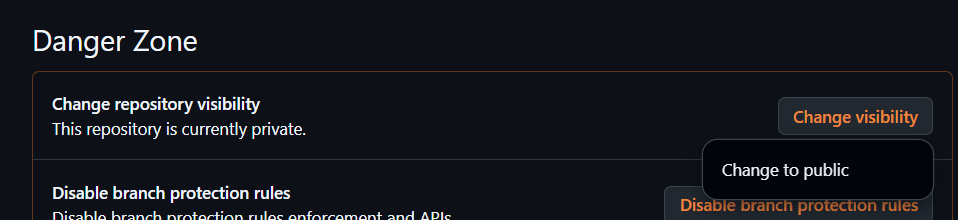
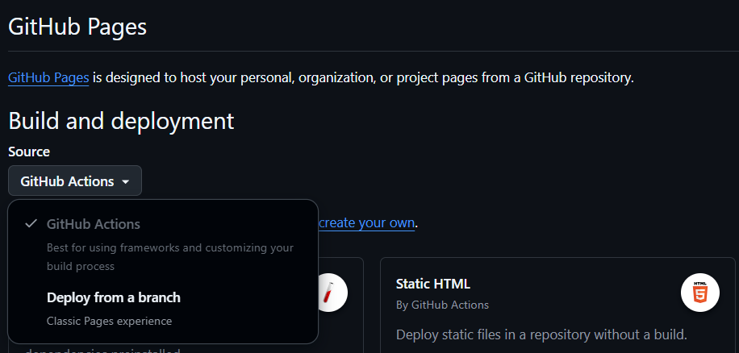
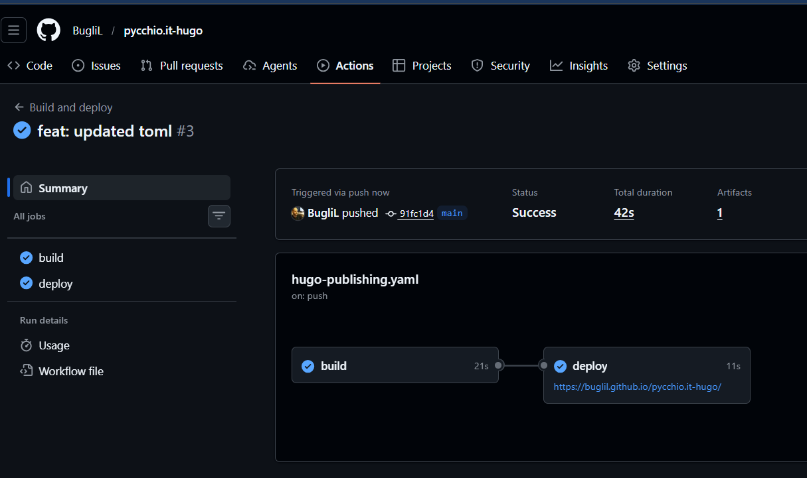

The best way I found to automate the deployment of my blog is to use 
`GitHub Actions` and `GitHub Pages`. I think there are many ways to do it, maybe
easier, but this  was the straightforward way I found to do it with the tools I
already use.

## What are GitHub Actions?
From official documentation: [GitHub Actions](https://docs.github.com/en/actions/get-started/understand-github-actionsO

> GitHub Actions is a continuous integration and continuous delivery (CI/CD)
> platform that allows you to automate your build, test, and deployment pipeline.
> You can create workflows that build and test every pull request to your
> repository, or deploy merged pull requests to production.


Pratically, when something happens in your repository, like a push, a pull
request, or a release, you can trigger a workflow that will do something.

## Whate are GitHub Pages?
From official documentation: [GitHub Pages](https://docs.github.com/en/pages/getting-started-with-github-pages/what-is-github-pages)

> GitHub Pages is a static site hosting service that takes HTML, CSS, and
> JavaScript files straight from a repository on GitHub, optionally runs the files
> through a build process, and publishes a website.

The pages are hosted on `github.io` and you can use a custom domain if you want, more information can be found [here](https://docs.github.com/en/pages/configuring-a-custom-domain-for-your-github-pages-site).


## How to automate the deployment of my blog?


### Github repository configuration
I have found a good explanation [here](https://gohugo.io/host-and-deploy/host-on-github-pages/) 
on how to deploy a Hugo blog on GitHub Pages.  I created my repository as
`private`, but, unfortunately, GitHub Pages only works with public repositories
for free accounts. Since I don't want to pay for a personal GitHub account, I
have changed my repository to public.



I enabled GitHub Pages in the settings of my repository, and set the source for the publishing to `Github actions`:



### Hugo configuration
And I updated the `baseURL` in my `hugo.toml` file to point to the correct URL of my blog:

```toml
baseURL = 'https://buglil.github.io/pycchio.it-hugo/'
```

### GitHub Actions configuration
After that, I created a workflow file in my repository. 
`.github/workflows/hugo-publishing.yaml` content:

```yaml
name: Build and deploy
on:
  push:
    branches:
      - main
  workflow_dispatch:
permissions:
  contents: read
  pages: write
  id-token: write
concurrency:
  group: pages
  cancel-in-progress: false
defaults:
  run:
    shell: bash
jobs:
  build:
    runs-on: ubuntu-latest
    env:
      DART_SASS_VERSION: 1.97.3
      GO_VERSION: 1.26.0
      HUGO_VERSION: 0.156.0
      NODE_VERSION: 24.13.1
      TZ: Europe/Oslo
    steps:
      - name: Checkout
        uses: actions/checkout@v6
        with:
          submodules: recursive
          fetch-depth: 0
      - name: Setup Go
        uses: actions/setup-go@v6
        with:
          go-version: ${{ env.GO_VERSION }}
          cache: false
      - name: Setup Node.js
        uses: actions/setup-node@v6
        with:
          node-version: ${{ env.NODE_VERSION }}
      - name: Setup Pages
        id: pages
        uses: actions/configure-pages@v5
      - name: Create directory for user-specific executable files
        run: |
          mkdir -p "${HOME}/.local"
      - name: Install Dart Sass
        run: |
          curl -sLJO "https://github.com/sass/dart-sass/releases/download/${DART_SASS_VERSION}/dart-sass-${DART_SASS_VERSION}-linux-x64.tar.gz"
          tar -C "${HOME}/.local" -xf "dart-sass-${DART_SASS_VERSION}-linux-x64.tar.gz"
          rm "dart-sass-${DART_SASS_VERSION}-linux-x64.tar.gz"
          echo "${HOME}/.local/dart-sass" >> "${GITHUB_PATH}"
      - name: Install Hugo
        run: |
          curl -sLJO "https://github.com/gohugoio/hugo/releases/download/v${HUGO_VERSION}/hugo_extended_${HUGO_VERSION}_linux-amd64.tar.gz"
          mkdir "${HOME}/.local/hugo"
          tar -C "${HOME}/.local/hugo" -xf "hugo_extended_${HUGO_VERSION}_linux-amd64.tar.gz"
          rm "hugo_extended_${HUGO_VERSION}_linux-amd64.tar.gz"
          echo "${HOME}/.local/hugo" >> "${GITHUB_PATH}"
      - name: Verify installations
        run: |
          echo "Dart Sass: $(sass --version)"
          echo "Go: $(go version)"
          echo "Hugo: $(hugo version)"
          echo "Node.js: $(node --version)"
      - name: Install Node.js dependencies
        run: |
          [[ -f package-lock.json || -f npm-shrinkwrap.json ]] && npm ci || true
      - name: Configure Git
        run: |
          git config core.quotepath false
      - name: Cache restore
        id: cache-restore
        uses: actions/cache/restore@v5
        with:
          path: ${{ runner.temp }}/hugo_cache
          key: hugo-${{ github.run_id }}
          restore-keys:
            hugo-
      - name: Build the site
        run: |
          hugo build \
            --gc \
            --minify \
            --baseURL "${{ steps.pages.outputs.base_url }}/" \
            --cacheDir "${{ runner.temp }}/hugo_cache"
      - name: Cache save
        id: cache-save
        uses: actions/cache/save@v5
        with:
          path: ${{ runner.temp }}/hugo_cache
          key: ${{ steps.cache-restore.outputs.cache-primary-key }}
      - name: Upload artifact
        uses: actions/upload-pages-artifact@v3
        with:
          path: ./public
  deploy:
    environment:
      name: github-pages
      url: ${{ steps.deployment.outputs.page_url }}
    runs-on: ubuntu-latest
    needs: build
    steps:
      - name: Deploy to GitHub Pages
        id: deployment
        uses: actions/deploy-pages@v4

```

What does this workflow do?
In details, this workflow does the following using a `ubuntu-latest` runner:
- Sets up the environment with the necessary tools and dependencies versions (Go, Node.js, Dart Sass, Hugo)
- Checks out the code from the repository, including submodules (if any)
- Setup Go
- Setup Node.js
- Configure GitHub Pages
- Create a directory for user-specific executable files
- Install Dart Sass
- Install Hugo
- Verify the installations of the tools with their versions
- Install Node.js dependencies if a `package-lock.json` or `npm-shrinkwrap.json` file is present
- Configure Git to not quote paths
- Restore Hugo cache if available
- Build the site using Hugo with garbage collection, minification, and the correct base URL
- Save the Hugo cache for future runs
- Upload the generated files as an artifact
- Deploy the site to GitHub Pages using the uploaded artifact

I don't have to do anything, just push my changes to the `main` branch and the
workflow will take care of the rest. It will build the site and deploy it to
GitHub Pages.



It works, not so much effort (few configurations bug but that's it), and I don't
have to do anything, just push my changes to the `main` branch and the workflow
will take care of the rest. 

Something is still itching me, I don't like this HUGE workflow file, I want to
make it smaller with less and different steps:

```bash
git diff HEAD^ -- .github/workflows/ > diff.diff
```

```diff
diff --git a/.github/workflows/hugo-publishing.yaml b/.github/workflows/hugo-publishing.yaml
index 56caec8..a210db0 100644
--- a/.github/workflows/hugo-publishing.yaml
+++ b/.github/workflows/hugo-publishing.yaml
@@ -3,6 +3,9 @@ on:
   push:
     branches:
       - main
+    paths-ignore:
+      - README.md
+      - LICENSE
   workflow_dispatch:
 permissions:
   contents: read
@@ -10,7 +13,7 @@ permissions:
   id-token: write
 concurrency:
   group: pages
-  cancel-in-progress: false
+  cancel-in-progress: true
 defaults:
   run:
     shell: bash
@@ -18,78 +21,40 @@ jobs:
   build:
     runs-on: ubuntu-latest
     env:
-      DART_SASS_VERSION: 1.97.3
       GO_VERSION: 1.26.0
       HUGO_VERSION: 0.156.0
-      NODE_VERSION: 24.13.1
-      TZ: Europe/Oslo
+      TZ: Europe/Rome
     steps:
       - name: Checkout
         uses: actions/checkout@v6
         with:
-          submodules: recursive
           fetch-depth: 0
       - name: Setup Go
         uses: actions/setup-go@v6
         with:
           go-version: ${{ env.GO_VERSION }}
           cache: false
-      - name: Setup Node.js
-        uses: actions/setup-node@v6
-        with:
-          node-version: ${{ env.NODE_VERSION }}
       - name: Setup Pages
         id: pages
         uses: actions/configure-pages@v5
-      - name: Create directory for user-specific executable files
-        run: |
-          mkdir -p "${HOME}/.local"
-      - name: Install Dart Sass
-        run: |
-          curl -sLJO "https://github.com/sass/dart-sass/releases/download/${DART_SASS_VERSION}/dart-sass-${DART_SASS_VERSION}-linux-x64.tar.gz"
-          tar -C "${HOME}/.local" -xf "dart-sass-${DART_SASS_VERSION}-linux-x64.tar.gz"
-          rm "dart-sass-${DART_SASS_VERSION}-linux-x64.tar.gz"
-          echo "${HOME}/.local/dart-sass" >> "${GITHUB_PATH}"
       - name: Install Hugo
         run: |
-          curl -sLJO "https://github.com/gohugoio/hugo/releases/download/v${HUGO_VERSION}/hugo_extended_${HUGO_VERSION}_linux-amd64.tar.gz"
-          mkdir "${HOME}/.local/hugo"
-          tar -C "${HOME}/.local/hugo" -xf "hugo_extended_${HUGO_VERSION}_linux-amd64.tar.gz"
-          rm "hugo_extended_${HUGO_VERSION}_linux-amd64.tar.gz"
-          echo "${HOME}/.local/hugo" >> "${GITHUB_PATH}"
-      - name: Verify installations
-        run: |
-          echo "Dart Sass: $(sass --version)"
-          echo "Go: $(go version)"
-          echo "Hugo: $(hugo version)"
-          echo "Node.js: $(node --version)"
-      - name: Install Node.js dependencies
-        run: |
-          [[ -f package-lock.json || -f npm-shrinkwrap.json ]] && npm ci || true
-      - name: Configure Git
-        run: |
-          git config core.quotepath false
-      - name: Cache restore
-        id: cache-restore
-        uses: actions/cache/restore@v5
+          curl -sLJO "https://github.com/gohugoio/hugo/releases/download/v${HUGO_VERSION}/hugo_extended_${HUGO_VERSION}_linux-amd64.deb"
+          sudo dpkg -i "hugo_extended_${HUGO_VERSION}_linux-amd64.deb"
+          rm "hugo_extended_${HUGO_VERSION}_linux-amd64.deb"
+      - name: Cache Hugo modules
+        uses: actions/cache@v5
         with:
           path: ${{ runner.temp }}/hugo_cache
-          key: hugo-${{ github.run_id }}
-          restore-keys:
-            hugo-
-      - name: Build the site
+          key: hugo-${{ hashFiles('go.sum') }}
+          restore-keys: hugo-
+      - name: Build
         run: |
           hugo build \
             --gc \
             --minify \
             --baseURL "${{ steps.pages.outputs.base_url }}/" \
             --cacheDir "${{ runner.temp }}/hugo_cache"
-      - name: Cache save
-        id: cache-save
-        uses: actions/cache/save@v5
-        with:
-          path: ${{ runner.temp }}/hugo_cache
-          key: ${{ steps.cache-restore.outputs.cache-primary-key }}
       - name: Upload artifact
         uses: actions/upload-pages-artifact@v3
         with:
```

Much clearer and easier to read. Less steps, less code, and it does the same
thing. What did I changed? 

- I removed the setup of Node.js and Dart Sass, since I don't use them in my
  blog, and they are not necessary for the build process.

- I added a `paths-ignore` to the trigger of the workflow, so it doesn't run
  when I push changes to files that are not relevant for the blog, like
  `README.md` and `LICENSE`. I think I will add more files.

- I changed the concurrency to cancel in progress, so if I push multiple times
  in a short time, only the last one will be deployed, and the previous ones will
  be cancelled. This is useful to avoid multiple deployments in a short time, and
  to save resources.

- I changed the cache key to use the hash of the `go.sum` file, so it will only
  restore the cache if the dependencies have changed, and it will save a lot of
  time if the dependencies are not changed.

- I removed the step to verify the installations of the tools, since it's not
  necessary for the build process, and it doesn't add much value.

- The package installation of Hugo is faster than the tarball extraction, and it also
  takes care of the dependencies, so I changed it to use the `.deb` package
  instead of the tarball.

The final result


```yaml
name: Build and deploy
on:
  push:
    branches:
      - main
    paths-ignore:
      - README.md
      - LICENSE
  workflow_dispatch:
permissions:
  contents: read
  pages: write
  id-token: write
concurrency:
  group: pages
  cancel-in-progress: true
defaults:
  run:
    shell: bash
jobs:
  build:
    runs-on: ubuntu-latest
    env:
      GO_VERSION: 1.26.0
      HUGO_VERSION: 0.156.0
      TZ: Europe/Rome
    steps:
      - name: Checkout
        uses: actions/checkout@v6
        with:
          fetch-depth: 0
      - name: Setup Go
        uses: actions/setup-go@v6
        with:
          go-version: ${{ env.GO_VERSION }}
          cache: false
      - name: Setup Pages
        id: pages
        uses: actions/configure-pages@v5
      - name: Install Hugo
        run: |
          curl -sLJO "https://github.com/gohugoio/hugo/releases/download/v${HUGO_VERSION}/hugo_extended_${HUGO_VERSION}_linux-amd64.deb"
          sudo dpkg -i "hugo_extended_${HUGO_VERSION}_linux-amd64.deb"
          rm "hugo_extended_${HUGO_VERSION}_linux-amd64.deb"
      - name: Cache Hugo modules
        uses: actions/cache@v5
        with:
          path: ${{ runner.temp }}/hugo_cache
          key: hugo-${{ hashFiles('go.sum') }}
          restore-keys: hugo-
      - name: Build
        run: |
          hugo build \
            --gc \
            --minify \
            --baseURL "${{ steps.pages.outputs.base_url }}/" \
            --cacheDir "${{ runner.temp }}/hugo_cache"
      - name: Upload artifact
        uses: actions/upload-pages-artifact@v3
        with:
          path: ./public
  deploy:
    environment:
      name: github-pages
      url: ${{ steps.deployment.outputs.page_url }}
    runs-on: ubuntu-latest
    needs: build
    steps:
      - name: Deploy to GitHub Pages
        id: deployment
        uses: actions/deploy-pages@v4
```

So, here it is, a simple and clear workflow to automate the deployment of my blog to GitHub Pages. I don't have to do anything, just push my changes to the `main` branch and the workflow will take care of the rest.

Let's write more posts!