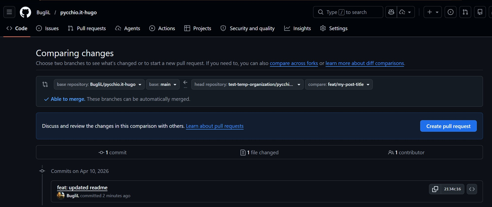
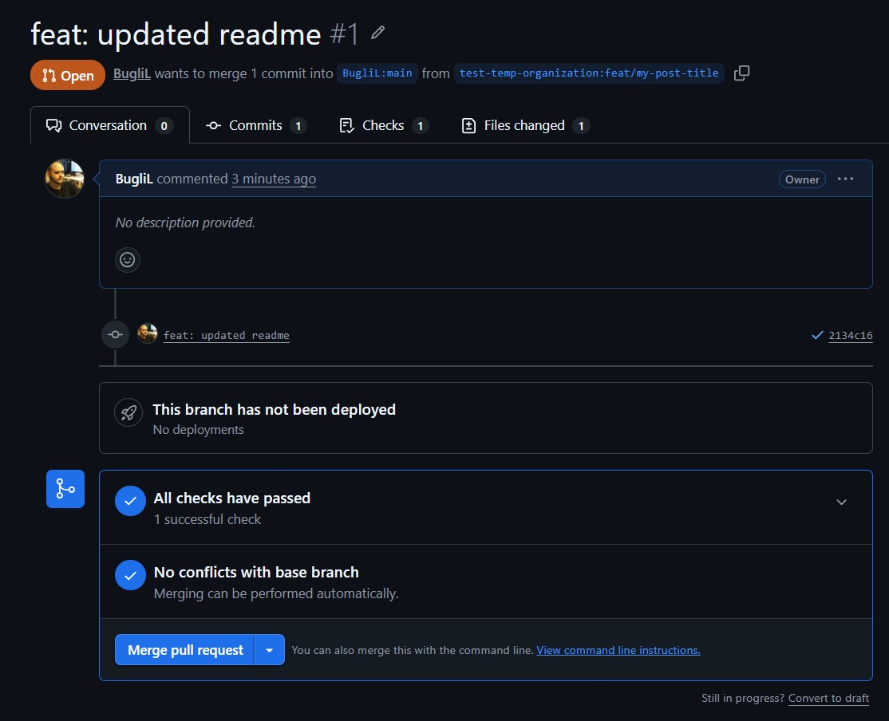
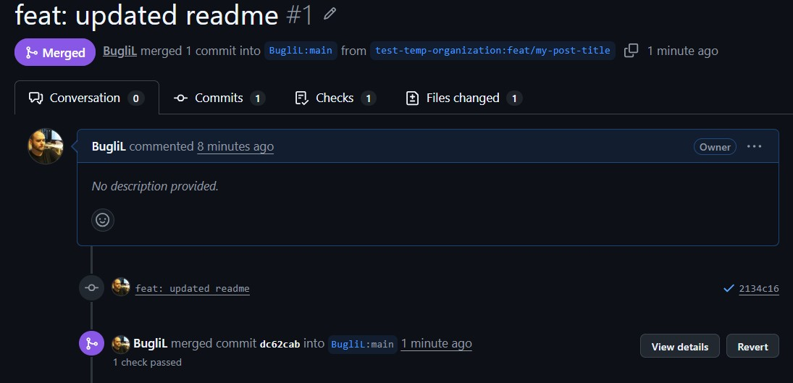
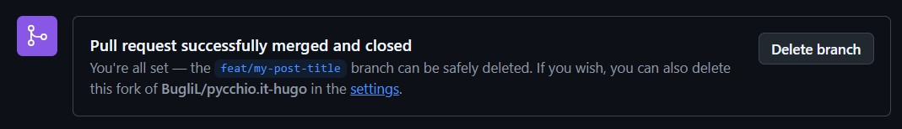
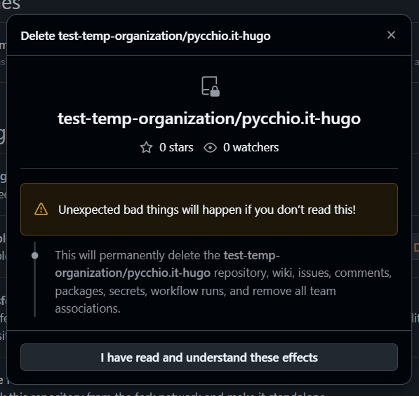
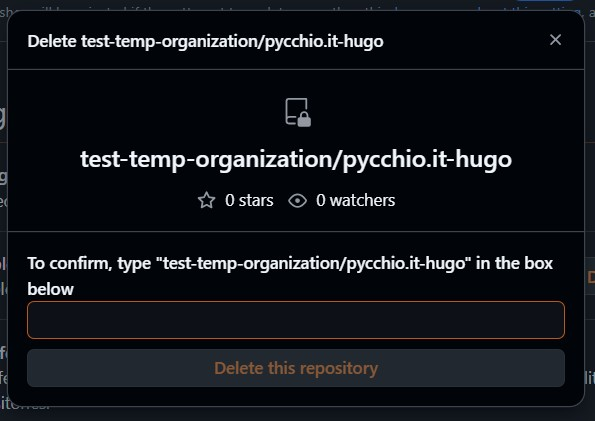

Remotes are just pointers to repositories, and they are very useful when you
have more than one source of truth for your code. When you clone a repository,
you get a default remote called `origin` that points to the original repository.
I will write down the flow and the commands that I have used to manage my
remotes when I wanted to contribute to a repository that I don't have write
access to. 

I will use this blog repository as an example to explain the flow and be less
abstract, [pycchio.it-hugo](https://github.com/BugliL/pycchio.it-hugo).

## Git clone

When contributing to a remote repository, you often need to clone the repository
to your local machine to update the code. If I want to clone the repository of 
this blog, the command is 

```
git clone git@github.com:BugliL/pycchio.it-hugo.git
```

This command creates a local copy of the remote repository on your machine. This
is not the only thing that it does. It also sets up a remote called `origin`
that points to the original remote repository.

```
git remote -v
```

The output of this command is this

```
origin  git@github.com:BugliL/pycchio.it-hugo.git (fetch)
origin  git@github.com:BugliL/pycchio.it-hugo.git (push)
```

What does it mean? 
- origin → the name of your remote (default when you clone from GitHub)
- URL (`git@github.com:BugliL/pycchio.it-hugo.git`) → where the repository lives
- (fetch) → used when you pull/download changes
- (push) → used when you upload changes

It means that when you run `git push` or `git pull`, git will know that you want
to push or pull from the `origin` remote, which is the original repository that
you cloned from. 


## What about forks?

A `fork` is a copy of a repository that you can use to make changes without
affecting the original one. When you want to contribute to a repository that you
don't have write access to, you need to `fork` the repository on GitHub. 
[How to create a fork on github](https://docs.github.com/en/pull-requests/collaborating-with-pull-requests/working-with-forks/fork-a-repo)

This operation creates a copy of the original repository under your GitHub
account. To fork my own repository I have create a temporary organization on
GitHub https://github.com/test-temp-organization and forked the repository
there. Direct link to the forked repository https://github.com/test-temp-organization/pycchio.it-hugo


When you clone your forked repository, the
`origin` remote will point to your forked repository, not the original one. 

```
git clone git@github.com:test-temp-organization/pycchio.it-hugo.git pycchio-it-hugo-fork
```
```
Cloning into 'pycchio-it-hugo-fork'...
remote: Enumerating objects: 255, done.
remote: Counting objects: 100% (255/255), done.
remote: Compressing objects: 100% (156/156), done.
remote: Total 255 (delta 100), reused 210 (delta 55), pack-reused 0 (from 0)
Receiving objects: 100% (255/255), 5.20 MiB | 5.52 MiB/s, done.
Resolving deltas: 100% (100/100), done.
```
To add the original repository as a remote, you need to run the following
command in the terminal while being in the local repository of your forked
repository.

```
git remote add upstream git@github.com:BugliL/pycchio.it-hugo.git
```

Now you have two remotes, `origin` and `upstream`. The `origin` remote points to
your forked repository, while the `upstream` remote points to the original
repository. 

```
git remote -v
```
```
origin      git@github.com:test-temp-organization/pycchio.it-hugo.git (fetch)
origin      git@github.com:test-temp-organization/pycchio.it-hugo.git (push)
upstream    git@github.com:BugliL/pycchio.it-hugo.git (fetch)
upstream    git@github.com:BugliL/pycchio.it-hugo.git (push)
```
- origin → your copy of the repository
- upstream → the original source repository


## Create a new feature

When I want to create a new post, one that is not directly related to the code
of the blog, I create a new branch called `new-post` and then I push it to my
forked repository. I prefer this to develop all my ideas in a separate branch,
so I can keep the `main` the publishing of my blog clean.

Those are the commands that I run in the terminal to create a new branch and
push it to my forked repository.

```
git checkout -b feature/my-post-title
git push -u origin feature/my-new-feature
```

- `git checkout -b` → create a new branch and switch to it
- `feature/my-post-title` → the name of the branch
- `git push` → push the branch to the remote repository
- `-u` → short for `--set-upstream` set the upstream of the branch to the remote branch
- `origin` → the name of the remote repository (your forked repository)
- `feature/my-new-feature` → the name of the branch on the remote repository

After editing something I need to commit the changes and push them to the remote
repository on the feature branch. 

```
git add .
git commit -m "feat: add new post about git remote management"
git push
```
```
Enumerating objects: 5, done.
Counting objects: 100% (5/5), done.
Delta compression using up to 8 threads
Compressing objects: 100% (3/3), done.
Writing objects: 100% (3/3), 638 bytes | 638.00 KiB/s, done.
Total 3 (delta 1), reused 0 (delta 0), pack-reused 0
remote: Resolving deltas: 100% (1/1), completed with 1 local object.
remote:
remote: Create a pull request for 'feat/my-post-title' on GitHub by visiting:
remote:      https://github.com/test-temp-organization/pycchio.it-hugo/pull/new/feat/my-post-title
remote:
To github.com:test-temp-organization/pycchio.it-hugo.git
 * [new branch]      feat/my-post-title -> feat/my-post-title
branch 'feat/my-post-title' set up to track 'origin/feat/my-post-title'.
```

How do I update the orginal repository with the changes that I made on my forked
repository? I need to create a pull request on GitHub between forks.

Here is the link about [How to create a pull request on github](https://docs.github.com/en/pull-requests/collaborating-with-pull-requests/proposing-changes-to-your-work-with-pull-requests/creating-a-pull-request-from-a-fork)



- Go to the repository of your forked one on GitHub
- Click on the "Pull requests" tab
- Click on the "New pull request" button
- Select the branch that you want to merge into the original repository (the base)
- Select the branch that you want to merge from your forked repository (the compare)
- Click on the "Create pull request" button
- Add a title and a description to your pull request
- Click on the "Create pull request" button



After creating the pull request, you need to wait for the maintainers of the
original repository to review your changes and merge them. If they have any
comments or suggestions, they will leave them on the pull request. You can reply
to their comments and make changes to your branch if needed. Once the pull
request is merged, your changes will be part of the original repository and you
can delete your branch if you want to keep your repository clean.



After the pull request is merged, you can delete your branch on your forked
repository to keep it clean. You can do this on GitHub by clicking on the
"Delete branch" button on the pull request page or by running the following
command in the terminal while being in the local repository of your forked repository.



```
git branch -d feature/my-post-title
git push origin --delete feature/my-post-title
```


## Update your forked repository

When the original repository is updated with new changes, you need to update
your forked repository to keep it in sync with the original one. You can do this
by running the following commands in the terminal while being in the local
repository of your forked repository.

```
git checkout main
git pull upstream main
git push origin main
```

- `git checkout main` → switch to the main branch
- `git pull upstream main` → pull the changes from the original repository (upstream)
- `git push origin main` → push the changes to your forked repository (origin)


```
remote: Enumerating objects: 6, done.
remote: Counting objects: 100% (6/6), done.
remote: Compressing objects: 100% (3/3), done.
remote: Total 4 (delta 2), reused 2 (delta 1), pack-reused 0 (from 0)
Unpacking objects: 100% (4/4), 1.39 KiB | 285.00 KiB/s, done.
From github.com:BugliL/pycchio.it-hugo
 * branch            main       -> FETCH_HEAD
 * [new branch]      main       -> upstream/main
Updating cdc5f5d..dc62cab
Fast-forward
 README.md | 9 ++++++++-
 1 file changed, 8 insertions(+), 1 deletion(-)
```
```
Total 0 (delta 0), reused 0 (delta 0), pack-reused 0
To github.com:test-temp-organization/pycchio.it-hugo.git
   cdc5f5d..dc62cab  main -> main
```

Contribution made! 
If no more functions are added to the original repository, you can delete your
forked repository to keep your GitHub account clean. You can do this on GitHub
by going to the settings of your forked repository and clicking on the "Delete
this repository" button at the bottom of the page. You will be asked to type the
name of the repository to confirm the deletion.





Everything done!


## References

If someone wants to learn about git and git commands, I think the best practical
and theorical book you can find is `Git: Guida per imparare a gestire,
distribuire e versionare codice` written by [Ferdinando Santacroce](https://www.linkedin.com/in/ferdinandosantacroce/)
and distrubuted by [Apogeo](https://www.apogeonline.com/libri/git-ferdinando-santacroce/).
It is a very good book that covers all the basics of git and also some advanced
topics. I highly recommend it to anyone who wants to learn git.


If you need an english version I think that 
[Git Essentials](https://www.bol.com/nl/nl/p/git-essentials-second-edition/9200000079289390/) 
from the same author is a good choice, but I haven't read it so I can't say for
sure. 


