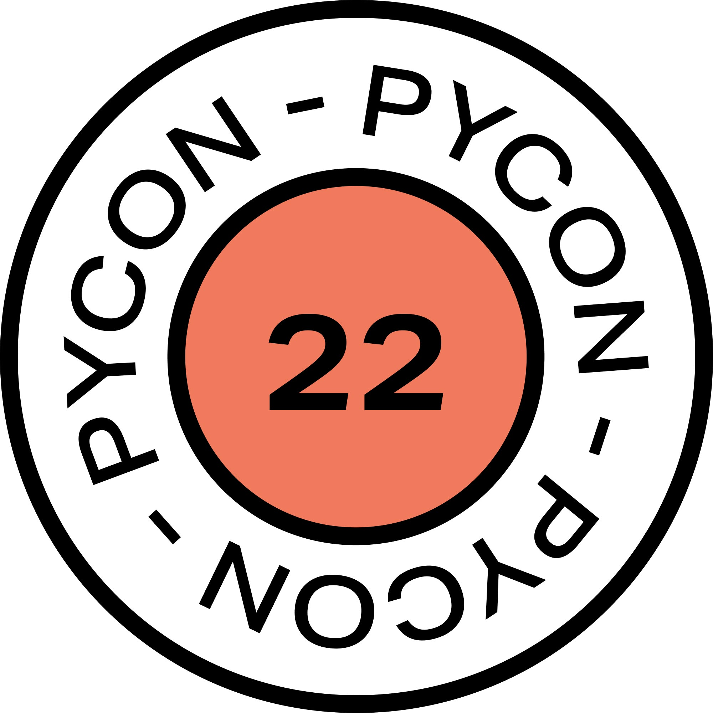
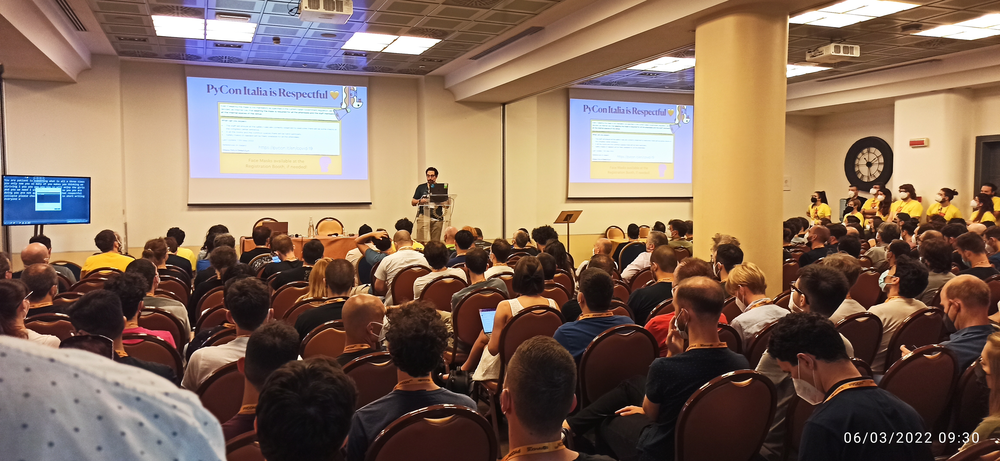

This is a post of my old blog, I moved it here to have all my content in one
place and translated it to English. It describes my experience at Pycon Italy
2022.

Few days ago Pycon Italy took place, the Python conference that takes place in
Florence. After 2 missed editions due to the pandemic I really missed
participating. Unlike previous years I prepared an agenda with all the talks to
follow and possible backup plans in case it was not possible.

The conference was divided into macro areas each with a specific topic:
- **PyData** : Talks related to data management and artificial intelligence
- **PyWeb** : Talks about the web world Flask/Django/FastApi and web integrations
- **PyBusiness** : Talks that concern Odoo or the use of Python intersected with more organizational/business aspects
- **Python & Friends** : Talks that concern everything that does not fit well in the other areas and generic talks
- **The Green Garden Stage** : New entry, talks related to aspects related to
  plants, they didn't have much to do with Python but they were nice
- **PyData Training** : Pydata but workshops
- **Training Web&Friends** : Pyweb but workshops    

Besides these technical talks there were a series of occasions to socialize,
Pybeer, Pyfiorentina held outside the conference. The first day, Thursday June
2nd, was dedicated to training on data analysis in Python that I did not follow.
The rest of the days I followed the talks in a scattered way, I did not follow
specifically, I went on what I needed at work and to update myself on the world
around me.

## Final thoughts

Besides technical talks, I also followed organizational talks, to understand how
to improve the development process at work. It's not just a matter of code
anymore, now those who develop all-round must take into account other aspects
such as relationships with colleagues and the entire development workflow.

## What did I bring back home?

I have discovered a tool that is very used **cookiecutter**. In
short **cookiecutter** is a Cookiecutter uses project templates (called
"cookiecutters") that define the structure and dependencies of the project,
along with other configurations such as the license, project metadata, and
installation instructions. Those templates are often created and shared by the
Python community, so developers can use them as a starting point for their
projects without having to reinvent the wheel.

As it is now well known, but it is good to reiterate, **Agile** is the
organizational theory now consolidated for software development. The
**waterfall** method, except in specific contexts, has a series of problems that
have emerged in several talks by people who have roles and skills very different
from each other. Feedback and communication is taking on a leading role in 360
degrees, both human feedback and that of computer and software. Understanding if
the software developed is correct and does the required job is fundamental and
is understood only through customer feedback: if there are biblical delivery
times such as months or years, it is understood of a design error after too much
time to easily remedy generating dissatisfaction in customer and developer. If
the development is divided into smaller batches and shown to the customer, there
are indications on the result of the development and the aim is quickly
corrected. From this we arrive at the concept of **continuos delivery**, a
continuous deploy of the application to have feedback from the customer.

Deploying old school, by hand, is not practical when it is necessary to do a
deploy every 2 weeks. Setting up a deploy automation at the moment of doing a
git push on ~~master~~ main has many advantages:

- who programs does not have to know the infrastructure or the specific system
  and can have only programming skills not system ones

- the deploy can take place at any time reducing the times of bugfix and patch

In this perspective machines and servers deploys are made eliminating much of
the human error that traditionally accompanies manual releases. Both concepts of
**Continuous Integration** and **Continuous Deployment** are fundamental in this
context.

**Continuous Integration** ensures that every change pushed to the repository is
automatically tested and validated, reducing integration issues and catching
bugs early in the development cycle and giving a strong feedback immediatly.

**Continuous Deployment** (or Continuous Delivery, depending on the level of
automation) takes this a step further by automatically releasing validated
changes into production or staging environments.

CI/CD pipelines automate the process of building, testing, and deploying code
changes, allowing teams to integrate new features frequently and safely. Those
pipelines enable rapid feedback loops, while maintaining high quality standards
through automated testing and validation processes.

Businesses are expected to respond quickly to user feedback, security
vulnerabilities, and market demands. Without automation, releasing updates
frequently would require significant manual effort, increasing both cost and
risk. 

Another critical advantage is consistency across environments. By defining
infrastructure and deployment steps as code, teams ensure that development,
testing, and production environments behave in the same way. This reduces the
classic “it works on my machine” problem and improves collaboration between
developers, operations, and QA teams—often referred to as DevOps culture.

Moreover, CI/CD improves traceability and accountability. Every change is
tracked, tested, and logged, making it easier to identify when and where issues
are introduced. Rollbacks become safer and faster, and auditing changes becomes
straightforward, which is especially important in regulated industries.

In modern cloud-native architectures, where applications are composed of
microservices and distributed systems, CI/CD is not just a convenience but a
necessity. The complexity and scale of these systems demand automation to ensure
reliability and resilience. Manual processes simply cannot keep up with the
volume and frequency of changes.

In summary, moving from manual deployments to automated CI/CD pipelines
reduces human error, accelerates feedback cycles, ensures consistency across
environments, and enables teams to focus on delivering value rather than
managing infrastructure.

Resources:

- [cookiecutter](https://github.com/cookiecutter/cookiecutter)

