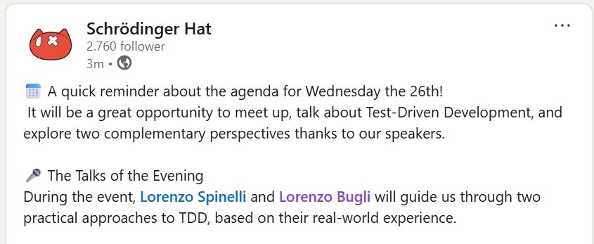
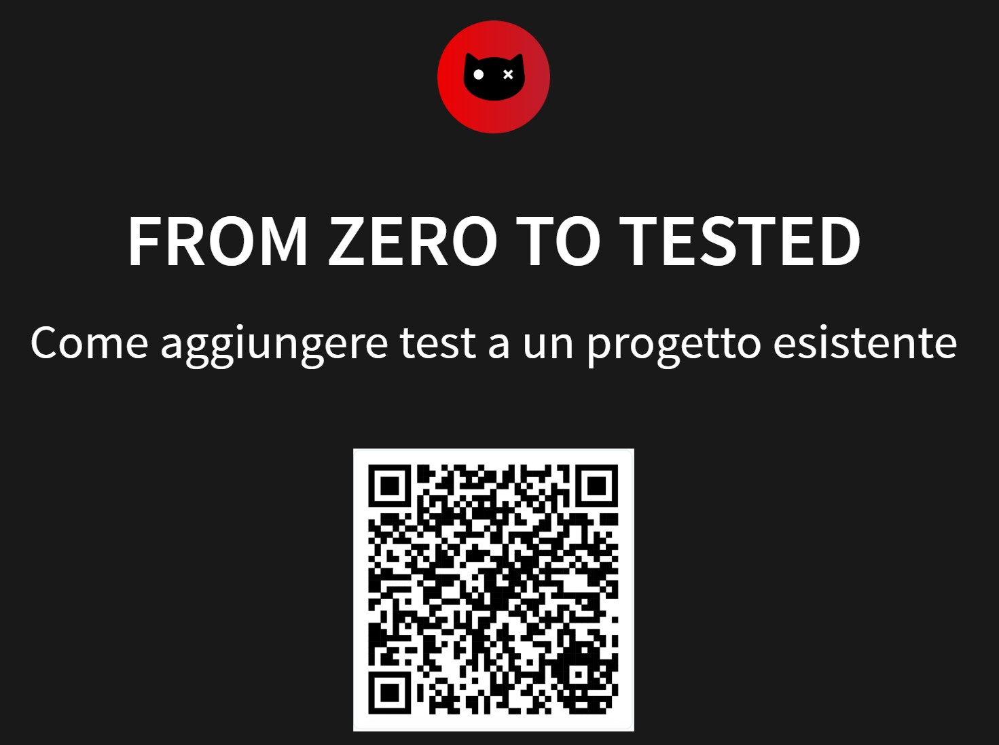
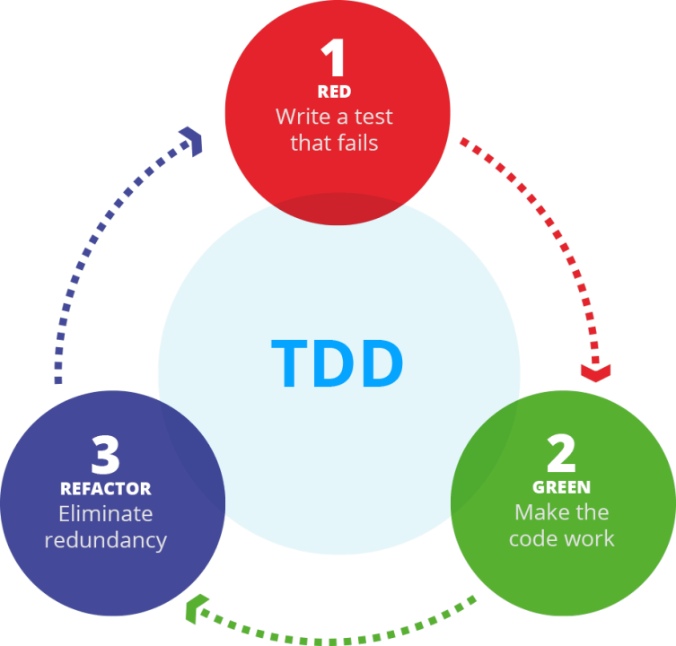

There's something I wish I knew when I first started learning Test-Driven
Development (TDD): it's, how can I manage to apply TDD in a project that has no
tests at all? Where do I even start? What if I break something while trying to
add tests? 

I decided to share my experience and insights on this topic in a talk I recently
During my recent talk at `SH Branches` entitled `From Zero to Tested` I shared
my personal experience of learning TDD in a specific context and how I overcame
the challenges I faced along the way. 

[link to post](https://www.linkedin.com/posts/schroedinger-hat_a-quick-reminder-about-the-agenda-for-activity-7398726793177845760-X2jH)

> 🚀 From Zero to Tested
> Applying TDD “on paper” is one thing; making it actually work on a real codebase
> is another. In this session, we’ll explore how to introduce TDD into an existing
> project, which strategies help you avoid getting stuck, how to deal with the
> initial complexity, and which patterns make the process smooth and natural. A
> practical talk, full of concrete examples and insights born from real scenarios.

The event was organized by 
[Schrödinger Hat](https://schroedinger-hat.org/participate/events/sh-session-tdd-test-driven-development), 
with the support of 
[The Social Hub Florence Belfiore](https://www.thesocialhub.co/florence-belfiore/), 
and is part of the SH Branches initiative, created to promote meetups focused on
knowledge-sharing, discussion, and networking across Italy and beyond.

Ticket were sold on [Eventbrite](https://www.eventbrite.it/e/sh-branches-tdd-test-driven-development-tickets-1965239560428)

## Content of the talk

[Slides liks](https://buglil.github.io/Talks/from-zero-to-tested/#/)

When you’re working on a real project, “starting to test” is never clean.
You don’t have an architecture designed for testing with isolated dependencies
and modular code, you have legacy code tight coupling logic scattered
everywhere. And that’s why people get stuck.

Because the first question isn’t:

> “How do I write a test?”

But:

> “How do I write the first test without breaking everything?”

The first step should not be strict TDD, high coverage, or elegant tests.
The first thing you should do is write tests that run.  Because at the
beginning, you’re not testing your code, you’re testing your testing setup.

Once you manage to write your first test, something interesting happens:
you start using tests to explore the code.

- what happens with weird inputs?
- what are the edge cases?
- does it really behave the way you expect?

Tests are not just about verification.
They’re a way to discover bugs and unexpected behavior.

At some point can happen that the code is hard to test and you start writing
workarounds because your design is fragile or the system is too coupled.

But what “tested” really means?

Getting to “tested” doesn’t mean:

- 100% coverage
- all tests passing

It means:

- you can change code without fear
- you quickly understand what breaks
- you get fast feedback

In other words: confidence in your system starting from tests

## Practical takeaways

If I had to summarize everything:

- Start with a simple test, even a useless one
- Use tests to understand code, not just validate it
- If something is hard to test → it’s hard to maintain
- Don’t chase coverage: chase understanding
- TDD is about design, not testing

“From zero to tested” is not a leap.

It’s a sequence of small steps:

- make a test run
- understand the code
- improve the design
- build confidence

