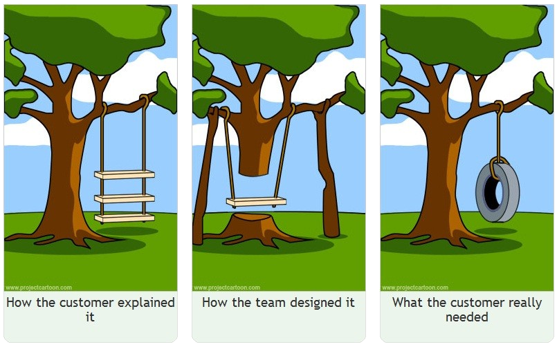

This is an interesting article from 
[Addy Osmani Blog](https://addyosmani.com/blog/21-lessons/)

## The hidden problem

Everybody prefer a tecnology over another one, I have my preferences, and I
like making things in a certain way, with specific patterns and tools. I've
always seached for the best way to do things to understand finally that `it
depends`. Why depends? Each time I'm writing a piece of software the most
important thing is not the code itself, but the problem that I'm trying to
solve. The `hidden problem` to solve to be precise.

There's always someone that bring you a "complete" solution.  The first question
to make him is "which is the problem to solve?". If no aswer, the solution is
pure garbage, it won't work at all.

The problem shows the solution, the solution decide the technology, starting in
the middle of this chain, is a recipe for disaster. I have seen many times
people that start to write (me included) without understanding the problem, and
they end up with a perfect software, a perfect code, clean too, but the users
hate it. 

Stop, `listen` and understand the needs.

People are not prepared to express the real problem, they don't know how to
tell their needs, and you should listen to them to look for the hidden small
details, the untold conversations, those small automatic tiny steps they make
automatically.

As Addy said, "The solution should emerge from that understanding", when the
problem is totally clear, the solution is just a consequence of it, and the
technology came after. It's not an obsession about research, it's about be sure
to fully understand the needs. 

This is not being a "best engineer", this is being a good one, a software
engineer that programs things once to be used by people everyday without lots of
fix and changes.

## Fail fast, fail safe

> You can edit a bad page, but you can't edit a blank one.
> The quest for perfection is paralysing

Never agreed more with a quote. I was a "bad" perfectionist, I wanted to write
the best code, the best design, the best architecture, but the result was I lost
of focus, and a lost of objective. What I've learned is summarized in this old
IPad commercial.

<iframe width="560" height="315"
src="https://www.youtube.com/embed/1I1hVBOPVkQ?si=A_IYea3ifW5uMFEi"
title="YouTube video player" frameborder="0" allow="accelerometer; autoplay;
clipboard-write; encrypted-media; gyroscope; picture-in-picture; web-share"
referrerpolicy="strict-origin-when-cross-origin" allowfullscreen></iframe>

You can create the best software ever but only when you give it to a user you will
see if works well and how he's using it. You can have the best design, but if
people don't understand how to use it, it's useless, it has no value. If you
show something to people and listen to their feedback, you will understand if
you are in the right direction.

Fast deployments, and fast feedback. 

This doesn't mean "deploy hard broken features" to production, but it means that
you shouldn't be afraid to ship something that is not perfect to make it be
tested. This allows more to understand people needs and to make the software
evolve in the right direction.

> Our highest priority is to satisfy the customer
> through early and continuous delivery of valuable software.

from [Agile manifesto principles](https://agilemanifesto.org/principles.html)

Monitoring and understanding if the problem is correctly solved guide next steps
of software evolution to a fix or to a new feature. Continuesly building new
feature being blind if everything already done is used as we designed it too.
Understaing user sadisfaction is the key to success, and that is only possible
giving people cutting boards to use!

## The best thing you can do it avoid writing code

I think I agree with the quote

> The best code is the code you never had to write.

but for a different reason. Addy is talking about the fact that if you can avoid
writing code, you should do it, because writing code is a risk, it's a source of
bugs, and it's a source of maintenance. 

Everything true, I agree with that but I think the best code is the code that
you never had to write because you can solve the problem in a totally different
way, without writing code at all. There are so many thing out there, so many
different software and tools that can me adapted to solve the problem without
writing a single line of code.

> Most performance wins come from removing work, not adding cleverness.

Most of the problems I faced with are not real software requirements, the
problem is hidden in the process, in the way people are doing it. Few years ago
I had lots of helpdesk tickets about a broken feature of a software. It was a
mess and was very difficult to understand the code and debug it. I decided to do
escalation of the problem talking directly to the users. I've substituted the
feature with a simple report created ad-hoc for that users and deleted the
feature. Everyone was happy, the users had what they needed, and I didn't have
to maintain something bad.

Focusing on the moon instead of the finger helps to find a better solution, and
sometimes the best solution is not writing code at all, it's only thinking about
the process and discuss with people to find a better way to achieve the same
goal offline too.

This concept goes well with usign a new technology to do the job. Are you
putting an home made cache solution or do you prefer to use Redis? Are you using
queues to do some background processing or do you prefer to use a service like
AWS SQS or RabbitMQ? Of course, it's technical debt, but it's a technical debt
that can be managable with small effort instead of inventing a new wheel and
maintain it for years.

> Novelty is a loan you repay in outages, hiring, and cognitive overhead.

I've learned this lesson the hard way.

First time I used `DJango` I was so excited! Every framework and every tool has
a downside, bigger or smaller but I couldn't see it at time. I know now that
there's lots of things behind the scenes that are critically and if not knowed,
they can cause a lot of problems in the future. 

You should be sure that you can manage and comprehend the new technology, it
can't be a leap of faith. Every technical debt is a loan, and you should be sure
that you can repay it in the future with paying fees of understanding and
knoledge. Make baby steps in adopting new technologies but is important to move
on a little bit. 

On the other hand, fossilizing on the same technology is a `technical debt` too,
it's a loan that you are taking to avoid the cognitive overhead of learning and
do something new, but you should be sure that you can repay it in the future
when the updating of the software is needed. That day will come, and if you are
not prepared, it will be a long work to do.

## Shared understanding...

In any product organization, real progress does not begin when code is written —
it begins when understanding is shared. Stakeholders define business goals,
product managers translate those goals into direction, and developers turn that
direction into working systems. Each group operates from a different
perspective, with different incentives and vocabularies. Without deliberate
alignment, these perspectives drift apart.

Without shared understanding, teams often build the wrong thing perfectly.
Developers may implement features exactly as written, yet miss the underlying
business objective. Product managers may prioritize based on assumptions that
were never validated technically. Stakeholders may expect outcomes that were
never realistically scoped. The result is rework — specifications rewritten,
features redesigned, timelines extended. Not because the team lacked skill, but
because they lacked a shared mental model.

Shared understanding between stakeholders, product managers, and developers is
the foundation of high-quality execution. It ensures that everyone agrees not
only on what is being built, but why it is being built, for whom, and how
success will be measured. When shared understanding is strong, conversations
shift from defensive corrections to collaborative problem-solving.

I've done a speech about this topic in a conference, and I've seen that many
people have the same problem in their teams. 

> Parlare la stessa lingua
> scrivere requisiti che diventano software

translated is

> Speak the same language
> write requirements that become software

[Link to presentation](https://buglil.github.io/Talks/parlare-la-stessa-lingua/#/)

The lack of communication is a common source of friction and inefficiency
between people. I've talked with many different people of different companies
and role, but everyone has the same problem, they don't understand each other,
they don't speak the same language, they don't have the same mental model.

In the end, true efficiency comes from `alignment`, not speed. Teams that invest
time in building a common understanding move with greater precision and far less
friction. When goals, constraints, and expectations are collectively understood,
specifications stop being open to interpretation and become shared commitments.
This clarity prevents unnecessary revisions, limits misunderstandings, and
ensures that what gets delivered matches what was intended.

## ...and shared documentation

This sharing of understanding is not only between people, but also between
engineers amd how they are doing things. Documentation is a key part of this
sharing, and it's not only about writing things down, but also about sharing the
knowledge and the understanding of how things are working. This helps engineers
debug things faster, undesrstand what could be the problem, and potentially how
to solve it.

Documentation and well-written comments are not bureaucratic overhead; they are
the infrastructure that allows teams to think clearly together without being
present physically. Without them, knowledge remains trapped in individual minds.
With them, understanding becomes shared, durable, and scalable.

It could not be a good idea to write documentation for every single line of
code, but it's easy to have TOO MUCH of it. Finding the right balance is a hard
task, but it's important to find it, in my experience, the best way to do it is
to write documentation for a big "why" than a small "how". "Why" is something
that is not changing much, and it's something that is not visible in the code,
on the other hand, "how" is something that is changing a lot, and it's something
time consuming when you have to update it.

"How" can be written by using "executable documentation" too.
Docker files, Terraform files, Ansible playbooks, and other forms of "executable
documentation" are particularly powerful. They not only describe how systems are
configured, but also serve as living documentation that evolves with the
software. Even for small projects I try to write down the infrastructure as
code, to have a clear understanding of how things are working for others and the
future me.  Devcontainers are a good example of this, they are a way to share
the development environment with other people, and they are a good way to
document the development environment setup.

IaC is the new way of writing infrastructure documentation, next to a small
markdown file when too much complicated.

## Conclusion
Ultimately, software engineering is far more than the act of writing code; it is
a human-centered discipline grounded in understanding, communication, and
thoughtful design. Code alone does not capture the intent behind decisions, the
context of requirements, or the trade-offs made along the way.

What distinguishes good engineering from mere coding is the ability to think
beyond syntax: to listen to users, to translate ambiguous needs into clear
solutions, to anticipate change, and to communicate ideas effectively to others.

In this sense, the heart of software engineering is not the lines of code we
produce, but the clarity, collaboration, and insight we leave behind as lasting
artifacts of thoughtful practice
